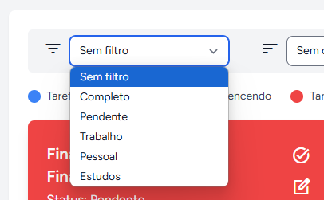

# Sistema de Gestão de Tarefas

Este é um sistema de gestão de tarefas construído com o framework Laravel. Ele implementa funcionalidades de CRUD (Create, Read, Update, Delete) de tarefas com autenticação e autorização utilizando o Laravel Breeze, além de notificações por e-mail e upload de arquivos de perfil.

<p align="center"></p>

## Funcionalidades

- **CRUD de Tarefas:** Criação, leitura, atualização e exclusão de tarefas.
- **Autenticação e Autorização:** Usando Laravel Breeze para autenticação de usuários.
- **Relacionamentos no Banco de Dados:** Relacionamento entre usuários e tarefas, e entre usuários e configurações do app.
- **Upload de Arquivos:** Permite o upload de fotos de perfil do usuário durante o registro e a edição.
- **Notificações por E-mail:** Notificações enviadas por e-mail quando tarefas são criadas ou editadas.
- **Status das Tarefas:** As tarefas podem ser marcadas como pendentes ou concluídas.
- **Categorias de Tarefas:** Categorias de tarefas, como trabalho, pessoal e estudos.
- **Filtros de Tarefas:** É possível filtrar as tarefas por:
  - Vencimento (mais antigo)
  - Vencimento (mais recente)
  - Status (pendente ou concluída)
  - Categoria (trabalho, pessoal, estudos)
  - Data de criação (mais antigo)
  - Data de criação (mais recente)

## Tecnologias Utilizadas

- **Laravel 11**
- **MySQL** como banco de dados
- **Blade** como engine de templates
- **Laravel Breeze** para autenticação e autorização
- **Tailwind CSS** para estilização do frontend
- **Laravel Notification** para notificações por e-mail
- **Google Fonts** para ícones personalizados
- **Laravel-pt-br-localization** para tradução do Laravel Breeze

## Pré-requisitos

- PHP >= 8.1
- Composer
- MySQL
- Node.js e NPM (para compilar os assets do frontend)

## Instalação

Siga os passos abaixo para rodar o projeto localmente.

### 1. Clone o repositório

```bash
git clone https://github.com/FelipeSDS23/sistema-de-gestao-de-tarefas.git
cd sistema-de-gestao-de-tarefas
```

### 2. Instale as dependências

```bash
composer install
npm install
```

### 3. Configure o ambiente

Crie um arquivo .env baseado no .env.example e ajuste as configurações conforme necessário:

```bash
cp .env.example .env
```

Edite o arquivo .env e altere as seguintes variáveis de ambiente:

```bash
FILESYSTEM_DISK=public
APP_TIMEZONE=America/Sao_Paulo
APP_LOCALE=pt_BR
APP_FALLBACK_LOCALE=pt-BR
```

### 4. Configure o banco de dados

```bash
DB_CONNECTION=mysql
DB_HOST=127.0.0.1
DB_PORT=3306
DB_DATABASE=sistema_de_gestao_de_tarefas
DB_USERNAME=root
DB_PASSWORD=
```

### 5. Gere as chaves de aplicativo

```bash
php artisan key:generate
```

### 6. Execute as migrações do banco de dados

```bash
php artisan migrate
```

### 7. Compile os assets do frontend

```bash
npm run dev
```

### 8. Execute o servidor de desenvolvimento

```bash
php artisan serve
```

Acesse o aplicativo através de http://localhost:8000.

* Observações
* O sistema utiliza Laravel Breeze para autenticação de usuários.
* Para tradução do Laravel Breeze, foi utilizado o pacote lucascudo/laravel-pt-br-localization. Certifique-se de que a tradução esteja corretamente configurada no seu ambiente.
* As fotos de perfil dos usuários são armazenadas no diretório public/storage/profile_pictures, portanto, certifique-se de ter configurado o link simbólico da pasta storage:

```bash
php artisan storage:link
```
Filtros de Tarefas
No painel de tarefas, você pode filtrar as tarefas com base em vários critérios:

* Vencimento (mais antigo): Ordena as tarefas pela data de vencimento, do mais antigo para o mais recente.
* Vencimento (mais recente): Ordena as tarefas pela data de vencimento, do mais recente para o mais antigo.
* Status: Filtra as tarefas de acordo com seu status (pendente ou concluída).
* Categoria: Filtra as tarefas com base na categoria (trabalho, pessoal, estudos).
* Data de Criação (mais antigo): Ordena as tarefas pela data de criação, do mais antigo para o mais recente.
* Data de Criação (mais recente): Ordena as tarefas pela data de criação, do mais recente para o mais antigo.

Imagens

Veja abaixo algumas imagens que ilustram a interface do sistema:

Tela Inicial


Tela de Login


Tela de Registro


Dashboard


Lista de Tarefas


Configurações do Usuário


Filtros de Tarefas


Edição de Perfil


Ícones
Os ícones utilizados no sistema são da Google Fonts. Acesse a página para consultar ou alterar os ícones:

<a href="https://fonts.google.com/icons" target="_blank">Google Fonts Icons</a>

